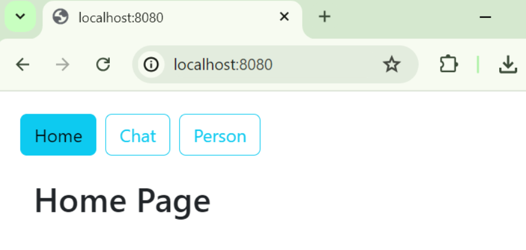

# Chat Bot Spring React - RAG

full stack web application based on Spring React with Vaadin which allows you to implement a Chat bot based on Retrieval Augmented Generation (RAG)
## Technologies

- Backend:
    - Spring Boot
    - Spring Data JPA
- Frontend:
    - React
- Database:
    - PostgreSQL (configurable)
- Chatbot:
    - Llama3
    - OpenAI API

